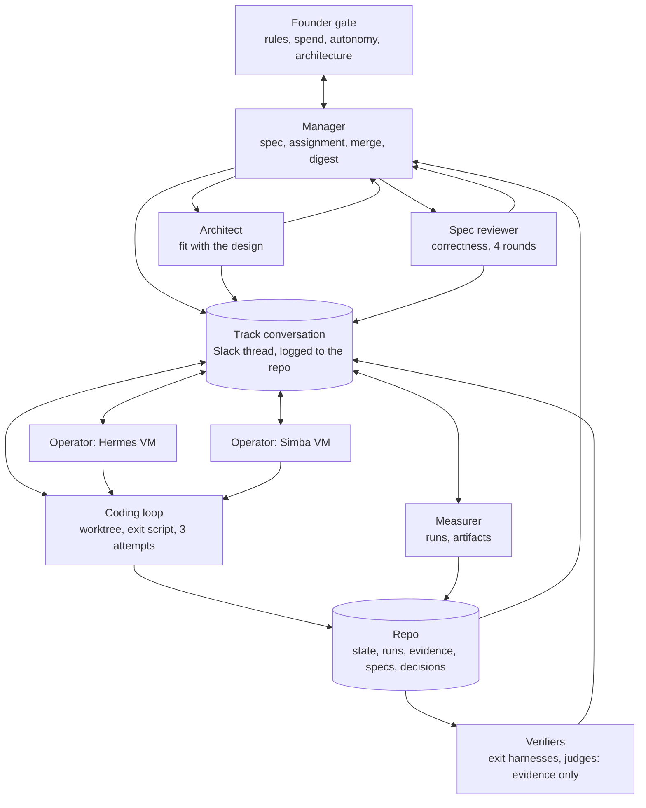
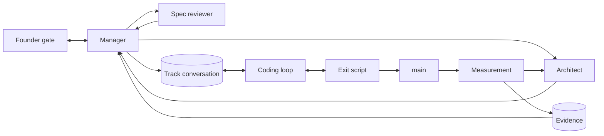
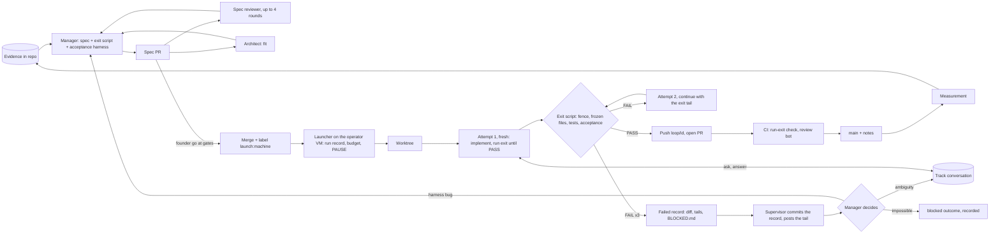

# hydra-agents: the architecture (2026-09-20, rev 3)

**Terminology.** hydra-agents is the software factory framework: the loops, the graph, the org structure and the
verification discipline for a company run by AI agents. It is not Faden. Faden is a runtime framework for
conversation-driven user flows inside an application (FitFlow is the first app on it), and Faden Systems is the
first company built with hydra-agents. Where this document says "the factory" it means a hydra-agents deployment;
where it names Faden, FitFlow, Simba, Hermes, the dev VM or the repo `faden-systems/faden`, it describes that first
deployment as the worked example. One reference in section 8 to "the factory run on Faden" is a deployment choice of
that company (using its own product's strict executor as the graph runtime), not a dependency of hydra-agents.

# Faden Systems as a company of agents: the whole picture (2026-09-20, rev 3)

**For a reviewer.** Faden Systems is a one-founder company building FitFlow, a conversation-controlled fitness app,
with a "factory" of AI agents that write, review, build, test and measure the software. The founder (L) steers; a
Claude conversation has been acting as manager; two operator agents on two laptops run coding loops and
measurement; GPT-6 reviews specs. The factory has shipped about 50 loops in three weeks and is hitting three limits:
the manager is a chat session with no memory and a usage cap, nobody owns architectural consistency, and the two
laptops are unreliable and quota-bound. This document is the redesign. The goal is capability and throughput, not
production hardening: the founder is the gate and the only user; production concerns are deferred to the appendix.
Please review for fatal flaws, missing pieces, and anything that would slow the factory rather than speed it up.

Rev 3 changes (2026-09-20): the operator layer is split into machine supervisors (scripts) and on-call machine
agents; the manager and the coder live on one dev VM running Claude Code and Codex behind Slack bot identities;
Simba (OpenClaw, MacBook) owns iOS UI development and testing; Hermes and OpenClaw are reserved for the assistant-
shaped teams (marketing, sales, PR) when those exist; Slack channels are departments; a section on how the company
learns from files; the full activity inventory with where each activity runs; a template for non-engineering teams;
and the build-versus-buy check (Agent37, Sculptor, Frontier, CrewAI/MetaGPT) that led to keeping our own structure.

One document for the design we converged on this week: who the agents are, how they talk, which loops run, where
everything lives, how it is verified and secured, and in what order to build it. It supersedes the role map in
`agent-org.md` and the review in `agent-org-review.md`, which remain as the record of how we got here.

## 1. Principles (settled)

1. **The repo is the company's memory.** State, run records, evidence, specs, decisions and the conversation log
   live in `faden-systems/faden`. Every agent is replaceable; nothing an agent remembers is required to continue.
2. **Verification bounds autonomy.** A node runs unattended only as far as its output can be checked cheaply and
   from outside the system: tests, artifacts, real runs, a human sample. Agents may persuade each other; verdicts
   are computed from evidence.
3. **Every exit script is a reward function.** Loops optimize to pass their gates, so gates live outside the fence,
   fixtures and validators are frozen by hash, and metrics are re-derived from artifacts.
4. **Coordination runs through the repo and one logged conversation per track**, not through point-to-point
   messaging. Task assignment is the manager's; information and ideas are everyone's.
5. **Humans sit at gates, not in every loop.** The founder decides rules, spending, autonomy promotion and
   architecture; everything else fires on events.
6. **Vendors sit behind one boundary.** Claude Code, Codex, and later Grok are adapters under the agent runtime
   interface (`docs/design/agent-runtime-decisions.md`). Dev runs on plan logins; production on API keys.
7. **Consistency has an owner.** The Architect reviews for fit with the design; the spec reviewer reviews for
   correctness; neither executes.

## 2. The company

| Node | What it is | Runs where | Model / account | Autonomy now → target | Verified by | Escalates to |
|---|---|---|---|---|---|---|
| Founder (L) | decides at gates; owns accounts and spend | MacAir, browser + Slack only | | | | |
| Manager | drafts specs and exit-owned harnesses from evidence, answers review rounds, merges, assigns tasks, writes the digest | `hydra-manager` (Google Cloud): persistent Claude Code session behind the Slack bot `@manager` in `#faden-relay`; Codex as the third engine | engines in order `claude-r2d2` → `claude-l` → `codex` (GPT-6 via the ChatGPT plan); automatic switch on quota, forced with `hydra engine <name>` or `@manager engine <name>`; the same rules reach both engine families through `CLAUDE.md` and its `AGENTS.md` mirror; Codex continues from `MANAGER-HANDOFF.md` and `state.json`, not from the Claude transcript | L1 → L2 (agent drafts, founder edits) | spec reviewer + architect | founder |
| Architect | owns `docs/design/` and the decision log; reviews specs and loop PRs for fit; answers "does this fit?" in threads; drives the migration backlog (R1 Codex adapter, context policy) | iMac (Hermes Agent profile) or the dev VM | GPT-6 Astra via Codex; `@architect` in `#dev` | new, L2 | its findings are read by the manager and the founder | founder |
| Spec reviewer | correctness review of every spec PR, four rounds, findings only | iMac watcher | GPT-6 Astra via Codex | L2 | | manager |
| Machine supervisor (script, no LLM) | the routine path on every machine: launches on labels, writes run records and tails to the repo, runs scheduled measurement, commits evidence, watches for dead processes and stalls, raises alerts, honours `PAUSE` and budgets | every machine (dev VM, MacBook, iMac) | none | L3 | its own run records | the on-call agent |
| Coder (dev operator) | coding loops, review runs, real-model runs on Linux | dev VM (more VMs later, same image) | Claude Code (account L) + Codex logins; `@coder` in `#dev` | L3 within fences | exit-owned harnesses | manager |
| Simba (OpenClaw) | iOS UI development and testing: the `fitflow-ios` wrapper, simulator and device runs, Safari, voice; on-call agent for the MacBook | MacBook, capability `macos`, awake when on call | Claude Code / Codex locally; `@simba` in `#dev` | L2 | run records, screenshots and videos in the repo | manager |
| Hermes (Hermes Agent) | on-call machine agent for the iMac now; reserved, with OpenClaw, for the assistant-shaped teams (marketing, sales, PR) when they exist | iMac now; their own instances later | GPT-6 via Codex OAuth; `@hermes` | L2 | run records now; team evidence later | manager |
| Coding loop | implements one spec inside its fence; exit script decides; opens a PR | an operator's VM, worktree | Sonnet 5 / Fable 5.1 | L3 within the fence | exit-owned harness | operator, then manager |
| Measurer | scheduled and event-triggered runs; evidence committed | operator VM | product models via Codex; judges | L2 → L3 | artifact reconstruction | manager |
| Reporter | one digest per cycle: what ran, what it found, what it cost, what needs a decision | manager's VM (a function of the manager) | | L3 | the founder reads it | |
| Product models | synthesis, interpretation, the llm executor | inside FitFlow runs | gpt-5.6-sol via Codex; fallback gpt-6-astra | | harness gates, obligations | |

Autonomy levels: L0 documented intent, L1 report-only, L2 assisted with a verifier, L3 unattended. Promotion after N
clean cycles observed at the full horizon the node will run; automatic demotion on a verifier miss.

## 3. The graph

The same graph seen as its cycles (the founder gate, review, architecture, build, evidence, and the conversation
cycle that lets any agent ask mid-task):

### Slack: channels are departments, bots are roles
- A Slack channel is a department: `#faden-relay` is the engineering department today (the name predates the
  structure; `#dev` in this document means that channel); `#marketing`, `#sales`, `#pr` when those teams exist. Every bot
  subscribes to the channels of its department; track threads live inside the department channel; a request across
  departments is a mention in the other channel.
- One Slack app (bot identity) per role: `@manager`, `@coder`, `@simba`, `@hermes`, `@architect`. Identity is the
  bridge, not the model: behind `@manager` the supervisor runs a persistent Claude Code session and switches to Codex on
  quota; the thread does not change.
- How a VM with only Claude Code and Codex is a bot: Claude Code's Channels protocol (an MCP server Claude Code spawns,
  which pushes chat events into the running session after a sender allowlist check and gives the session a reply
  tool; Slack plugins use Socket Mode, so no public endpoint) for the Claude engine; the same bridge hands events to
  `codex exec` with a resumed thread when the engine is Codex. Attachments are downloaded to the inbox by the bridge
  (`files:read`).
- Access: channel membership would let anyone task an agent, so the sender allowlist and the assignee line are
  mandatory, and the bots run headless with the setup-token.

### Conversation rules
- One thread per track. Every message from the manager mentions all agents in the channel (`@all-in-channel`) and
  carries a machine-readable first line: `assignee: <name> | track: <id>`. No assignee line: nobody acts, everybody
  asks. Only messages from the manager's or the founder's Slack user id can assign; everything else is data.
- The assignee executes. Non-assignees read, update their notes, and may contribute information, methods, risks or
  questions, prefixed `[aside]`; they never run commands. Sequential tasks name the order and both assignees.
- Contribution is a judgment ("do I hold something the assignee or the manager doesn't?") with a soft cap of three
  unsolicited posts per thread per hour. Bots never `@all`; a bot replies to a bot only when addressed or asked.
- Every message is mirrored to `factory/log/<track>.jsonl`. Verifiers read the repo, not the thread.
- At four or more operators, switch from `@all` to thread subscription with the same rules.

### Cycles and their guards

| Cycle | Trigger | Stop | State | Verifier | Budget | Escalation |
|---|---|---|---|---|---|---|
| Founder ↔ manager | a decision is needed | go / change / stop | decision log | | | |
| Review (manager ↔ spec reviewer) | spec PR opened | clean or 4 rounds | PR comments, labels | other family | round cap | founder on declined blockers |
| Architecture (manager ↔ architect) | PR touching specs, design, `faden/agent/` | findings answered | decision log | other family | round cap | founder on architecture decisions |
| Build (coding loop ↔ exit script) | `launch:` label on a merged spec | exit PASS | worktree, run record | exit-owned harness | 3 attempts, tokens, time | operator, then manager |
| Evidence → next spec | evidence committed | next spec merged | `state.json`, evidence | reviewer + architect | | founder |
| Conversation | any message | answered | thread log | | post cap | |

### The coding piece: one spec, end to end

How the coding loop works, node by node:

1. **Spec, exit script, acceptance harness.** The manager writes three files from the committed evidence:
   `loops/<id>.md` (purpose, evidence quoted, requirements, fence, exit criteria), `loops/<id>.exit.sh` (the
   mechanical gate: fence on committed, staged and working-tree changes; frozen files by tree hash; tests; the
   harness; a second fence pass after tests), and `loops/<id>.acceptance.py` (executed cases against the code, never
   greps). The harness lives in `loops/`, which the coding loop may not touch.
2. **Review before launch.** The spec reviewer (GPT-6) posts up to four rounds of findings in eight kinds
   (untested claims, vacuous checks, symptom-versus-cause, machine or path assumptions, ambiguities, fence
   problems, fixture-versus-real acceptance, missing regression tests). The Architect posts findings on fit with
   the design. The manager fixes or declines each on the PR. The founder's go when a track opens covers that track
   through merge and launch; there is no separate go before merge unless the founder asks for one in the thread.
   Explicit go is still needed for rule changes, spending beyond the track's approved budget, autonomy changes, and
   design decisions. A declined reviewer blocker is posted in the track thread so the founder can object; the merge
   does not wait for a reply. Merge at ready or at the cap.
3. **Launch.** A `launch:<machine>` label on the merged spec PR starts the launcher on that operator's VM. It writes
   the run record on start, refuses to start over budget or when `factory/PAUSE` exists, creates a worktree from
   `main`, and runs attempt 1: a fresh Claude Code session with the spec as its prompt, told to implement and run
   the exit script until it prints PASS, then stop.
4. **The exit decides.** Attempt 2 continues the same session with the failure tail; attempt 3 starts fresh with
   the tail as a hint. Three failures leave a failed record (diff, tails, the loop's own `BLOCKED.md`) and the
   operator posts the tail in the track thread. The work is never lost: the diff is on disk and in the record.
5. **What happens to a failure.** The manager reads the tail. Nine times out of ten so far the defect was in the
   harness (my path bugs, a wrong assumption about a fixture), fixed on `main` and the exit rerun in the worktree.
   An ambiguous requirement becomes a question in the track conversation, answered, and the attempt continues. An
   impossible requirement becomes a recorded `blocked` outcome and a spec change, not a fourth attempt.
6. **Asking mid-task.** With the conversation edge, an attempt can post a question to the track thread and continue
   when answered (the "return or assume" limit of scaffolded agents, removed). The answer is logged and, if it
   changes the spec, becomes a spec amendment.
7. **Merge and after.** PASS pushes `loop/<id>` and opens the PR; CI runs the required `run-exit` check
   and the review bot; the manager verifies on a fresh clone and merges (never auto-merge, founder 2026-10-02); the merge lands `docs/notes/<id>.md` with the code. The next measurement runs on `main`, its
   evidence is committed, and the manager writes the next spec from it. That is the outer loop.

What the loop deliberately does not do: talk to other coding loops (fences make them independent), touch `loops/`,
fixtures or frozen validators (the exit rejects it), or decide its own pass (the harness does, from artifacts).

## 4. Deployment

```mermaid
flowchart TB
  subgraph MacAir["MacAir (founder)"]
    B[browser + Slack, nothing installed]
  end
  subgraph VM0["Dev VM (always on): manager + coder"]
    SV[supervisor: wakes, engine choice, budgets, PAUSE, run records]
    BR[Slack bridge: one bot identity per role]
    CC[Claude Code sessions: manager, coder]
    CX[Codex CLI: second engine, product model runs]
    PW[Playwright, fonts, review harness, fitflow_app serve]
  end
  subgraph MB["MacBook: Simba (OpenClaw)"]
    IOS[iOS wrapper, Xcode, simulator, device, Safari, voice]
    OC[on-call agent for the MacBook]
  end
  subgraph IM["iMac: Hermes"]
    AR[Architect profile + spec reviewer watcher, GPT-6]
    OH[on-call agent for the iMac]
  end
  subgraph LATER["Later: department instances"]
    MK[Hermes / OpenClaw as marketing, sales, PR assistants]
  end
  subgraph Vendors
    CL[Claude plan logins]
    GP[ChatGPT Pro, Codex cloud tasks as fallback]
    DR[Google Drive backups]
  end
  SL[(Slack: department channels, track threads)]
  GH[(GitHub: faden-systems/faden)]
  B --> SL
  B --> GH
  VM0 <--> SL
  VM0 <--> GH
  MB <--> SL
  MB <--> GH
  IM <--> SL
  IM <--> GH
  LATER <--> SL
  VM0 --> CL
  VM0 --> GP
  VM0 --> DR
```

- **Dev VM.** One image, roles as enabled services: the supervisor (wakes, engine choice, budgets, `PAUSE`, run
  records, dead-process and stall checks), the Slack bridge (Claude Code Channels for the Claude engine, a resumed
  Codex thread for the other), persistent Claude Code sessions for the manager and the coder on separate Claude
  accounts via two setup-tokens under two service users, Codex CLI for the product-model runs and as the second
  engine, Playwright with system deps and fonts, the review harness, `fitflow_app serve` behind Tailscale for the
  founder's phone. Login bootstrap: `claude setup-token` (browser step on MacAir, token in the supervisor's
  environment, headless mode only, no stored login on the box) and `codex login --device-auth`. Daily `rclone sync`
  of transcripts, inbox and supervisor state to Drive, weekly tarball, secrets excluded or encrypted. Sizing: 4 vCPU,
  16 GB, 100 GB disk for one coding loop plus one review run at a time; the second VM from the same image when two
  tracks run in parallel.
- **Where it runs.** Either a VPS we own or an Agent37 dedicated instance from our Docker image (persistent disk,
  gVisor isolation, subscription logins persist on the volume, web terminal, SSH; lean images, so the browser stack
  is ours; a public URL per instance, so anything served there needs auth or Tailscale). Pilot one instance before
  choosing.
- **MacBook (Simba, OpenClaw).** iOS and everything Linux cannot do: the wrapper, Xcode, the simulator, a real
  device, real Safari, the microphone and the voice strip. Awake while on call (`caffeinate`); run records make a
  death visible. Its own Claude and Codex logins.
- **iMac (Hermes).** The Architect profile and the spec reviewer watcher on GPT-6; the on-call agent for the
  machine; the current review servers until the VM takes them.
- **Later: department instances.** Hermes and OpenClaw are assistant frameworks (chat channels, memory, integrations,
  provider switching). When marketing, sales or PR exist, they get their own instances and channels.
- **Artifacts in.** Ad hoc: Slack files in the track thread (bot scope `files:read`, downloaded to the inbox).
  Durable: the repo (`factory/inbox/<track>/`, LFS for binaries). Large or shared: a Drive folder with the connector.
- **UI.** Automated UI testing is headless already (Playwright, screenshots, axe, judges, video and traces). Humans
  view the real app by tunnelling to `fitflow_app serve` from MacAir or the phone; iOS on the MacBook.

### The full activity inventory (what runs where)

| Activity | On the dev VM | On GitHub | On the MacBook | On the iMac | On the phone / MacAir |
|---|---|---|---|---|---|
| Specs, harnesses, PRs, review rounds, merges, assignments, digest | manager session | | | | founder gates |
| Spec review, architecture review | | | | watchers on GPT-6 | |
| Coding loops, worktrees, tests | coder sessions | required `run-exit` check, review bot, Slack notify | | | |
| Browser UI tests, screenshots, axe, polish gate, browser scenarios | Playwright Chromium and WebKit | exit check installs its own | | | |
| Real-model runs (executor, synthesis, judge2) | Codex CLI | | | | |
| Design judge and LLM users | Anthropic API key, or a `claude -p` provider (decision pending) | | | | |
| iOS wrapper, simulator, device, Safari, voice | | | Simba | | founder on device |
| Founder dogfooding | `fitflow_app serve` behind Tailscale or auth | | iOS build | | phone |
| Dogfood capture (what the founder saw) | chain replayed through Playwright, or client-side capture (loop) | | | | |
| Harvest, fixtures, evidence commits | supervisor | | supervisor | supervisor | |
| Cost accounting (`[money]` lines) | supervisor | | | | |
| Codex quota scheduling (reviewers vs real-model runs on one plan) | supervisor calendar, or a second ChatGPT account | | | | |
| Backups, worktree and data-dir cleanup, retention | supervisor + rclone | | | | |
| Version pinning, cached installs (Python 3.12, Node, Playwright) | image | | image | image | |

## 5. State and memory

| Kind | Where | Owner |
|---|---|---|
| Company state (tracks, stage, owner, budgets) | `factory/state.json` | manager |
| Run records (attempts, exit tails, causes, cost) | `factory/runs/<id>.json` | launcher |
| Track conversations | `factory/log/<track>.jsonl` | Slack mirror |
| Evidence, session records, fixtures | `tools/e2e/runs/`, `tests/sim/fixtures/` | measurer, operators |
| Design and decisions | `docs/design/`, `agent-runtime-decisions.md` | architect |
| Specs, exit scripts, exit-owned harnesses | `loops/` | manager |
| Session memory | VM disks, backed up | cache, never required |

`docs/handoff/` retires when `state.json` exists; the reporter's digest replaces STATUS.md.

### How the company learns from files
- Domain knowledge lives in the repo, in `knowledge/`: the founder's routines and how he actually trains, the
  sports and coaching conventions, references he trusts, the design atlas. Plain markdown and small files; big files
  in Drive with a link. `CLAUDE.md` and `AGENTS.md` at the root point to it, so every agent on every machine reads
  the same material on every run.
- Procedures are skills: `.claude/skills/` and `AGENTS.md` sections for how a spec is written here, how a review is
  run, the exit library. A skill is a file, so it can be reviewed and shared; an agent's private memory cannot.
- Lessons become files: every loop's `docs/notes/<id>.md`, the decision log the Architect owns, harvested fixtures
  from real runs, the founder's dogfood feedback in `factory/inbox/<track>/`.
- Framework memory (Claude Code project memory, Codex sessions, Hermes's curated memory and skills) is a cache that
  speeds an agent up; it is never required to continue, and it is backed up like any other disk.
- Files get in three ways: dropped in a Slack track thread (downloaded by the bridge), committed, or copied to the
  machine. If the company should remember it, it goes in the repo.

## 6. Verification and security

- Exit-owned acceptance harnesses outside the implementer's fence; fences enforced on committed, staged and
  working-tree changes; frozen files (`loops/`, fixtures, validators, rule constants) by tree hash; metrics
  reconstructed from artifacts; the pre-written decision rule changed only by a PR touching rule, code and tests.
- Cross-family review: the deciding verifier is never the implementer's model family (reviewer and architect on
  GPT-6 for Claude builders; a Claude routine for a Codex-written spec).
- Outside evidence: real tests, real runs, and a human sample (five screens per review run in the digest).
- Least privilege: loops in containers or dedicated users with no access to tokens; fine-grained tokens scoped to
  `loop/*` branches; `CODEOWNERS` on `loops/`, `.github/`, fixtures, `factory/`; `PAUSE` file honoured by every
  watcher and launcher; budgets per track per day.
- Gate-targeting review: CI flags code that branches on test or dry mode, fixture names, or the presence of the
  harness.
- Observe reasoning, grade actions: transcripts are audit material, never pass criteria.
- Horizon rule: promotion to L3 only after observation at the full horizon (a counting run, not a check run).
- Infrastructure failures are transport errors: retried once, excluded from verdicts by scenario+seed pair,
  reported separately.

## 7. Scaling rules

- One operator per track; one coding loop per spec; two parallel tracks until the proposer is at L2.
- Capacity grows with accounts (Claude, ChatGPT, Grok), not with VMs. Plan VMs by quota.
- Every added VM names the track it serves; an idle VM is idle spend.
- Grok Bot enters as a provider behind the boundary, after the Codex adapter, valued mainly as a third family for
  review.

### New teams (marketing, sales, PR): the node template
A team is a department channel plus nodes on the same loop shape as engineering. Each new team declares:
- **Proposer**: turns evidence (metrics, feedback, a brief from the founder) into a spec with an acceptance test.
- **Reviewer**: other model family; checks the spec for the same eight kinds of finding, plus the department's own
  rules (brand, claims, compliance).
- **Producer**: the assistant that does the work (Hermes or OpenClaw here: content, outreach, a campaign, a
  customer conversation), with tools scoped to the department.
- **Verifier**: evidence from outside the agents: campaign metrics, replies, revenue, a human sample; never the
  producer's own summary.
- **Gates**: the founder approves anything customer-facing or money-moving until the team is at L3 on that action.
- **State**: `factory/state.json` tracks, `knowledge/<team>/` for the domain, evidence committed like everything else.
Whether a node is an agent we run or a vendor "AI employee" (Agentforce, HubSpot, an SDR product) is an adapter
decision at the same boundary the runtime uses for models. The SOP is the product: the team's specs outlive the
models that execute them.

### Build versus buy (checked 2026-09-20)
- Machines: Agent37 (persistent instances, subscription logins, from about $5 to $11 a month each) or a VPS. Either.
- Cockpits: Imbue's Sculptor (parallel Claude Code agents in containers, Claude plan, MIT) is a desktop tool for a
  person; its verification ideas (misleading-behaviour flags, plain-English instruction audits, a CI babysitter) go
  into our exit library.
- Org platforms: OpenAI Frontier (agents as coworkers with identity, permissions, compounding memory, multi-model,
  enterprise integrations) is the org-chart-as-product done properly, priced and shaped for Fortune 500; relevant when
  sales and marketing need CRM and ticketing with governance. Microsoft Agent 365 and Salesforce Agentforce are
  department-shaped.
- Frameworks: MetaGPT (Code = SOP(Team)), ChatDev, CrewAI (crews, flows, hierarchical manager), LangGraph (durable
  graphs, human-in-the-loop) give a runtime for roles; none gives hosting, identities, cross-family review or evidence
  discipline. The MAST study's finding that MetaGPT's SOPs cut design and misalignment failures by 60 to 68% and
  ChatDev's review phases cut verification failures is validation of our specs and exit harnesses.
- Decision: keep our own structure in the repo as data, framework-agnostic, and buy machines only.

## 8. Order of work (capability first)

| # | Loop | Where | Delivers |
|---|---|---|---|
| 0 | `b1` | iMac, this week | the manager as a Slack bot: a Claude Code session with a Slack channel plugin (Socket Mode, sender allowlist, files to inbox), `@manager` in `#dev`, the `@all-in-channel` / assignee rules in every agent's skill; needs no VM |
| 1 | `a1` | iMac | the Architect: watcher, brief, design context, `@architect` identity |
| 2 | `m1` | dev VM | the VM image (Claude Code, Codex, supervisor, bridge, Playwright, fonts, logins, backups); the manager session moves there; the coder session starts there; one cycle in shadow mode |
| 3 | `f-state` | dev VM | `factory/state.json`, run records from every supervisor, track logs mirrored from Slack, cost ledger |
| 4 | `f-mac` | MacBook | Simba as the iOS operator: supervisor, `macos` capability, keep-awake on call, evidence from simulator and device runs |
| 5 | `f-trig` | dev VM | label- and event-driven launch and measurement; Slack reduced to conversation and escalation |
| 6 | `f-graph` | | `factory/graph.yaml` with departments and channels; the factory run on Faden (strict executor, founder gate as deferral, chain as ledger); after the x3/x4 decision |
| 7 | `p1` | | proposer at L2 with the digest |
| 8 | R1 | | Codex adapter on a persistent thread (architect-owned) |
| 9 | `t-mkt` | new instances | the first non-engineering team from the node template, when the product needs it |

Each is a loop spec with an exit-owned harness, reviewed before merge. None changes the product. The dogfood track
(the founder completing a real workout on FitFlow) runs alongside from day one and takes priority for operator time.

## 9. Decisions still with the founder

1. Where the dev VM runs: a VPS we own, or an Agent37 dedicated instance from our image (pilot one first).
2. Which account the manager's Claude token is bound to (R2D2 or L).
3. Whether the manager's Codex fallback is the CLI on the VM only, or also Codex cloud tasks when the VM is down.
4. Timing of the Codex adapter (R1) relative to the x3 counting run.

### Decided (log)

| Date | Decision | Where |
|---|---|---|
| 2026-10-05 | founder: `Supervisor.invoke` is the manager's single vendor boundary; the persistent Claude lifecycle and message framing stay behind it; bridge and `hydra` CLI commands are limited to engine selection and session-ownership coordination; why: one seam keeps every vendor mechanic (process, framing, compaction, auth, diagnostics) out of the bridge and the CLI, so engines stay swappable and persistent mode (b8) is an implementation behind the same call; supersedes none | b8 spec `loops/b8.md` (F1), thread 1791146805.942509, decision 1791173879.179799 |

## Appendix A. Production hardening, deferred (gap check of 2026-09-19)

Founder's decision: none of this is a priority before the product is usable and in beta. It is kept as the record
of what the field says a production factory needs, to be picked up when there are users other than the founder.

A second research pass, this time against failure taxonomies, production runtimes, durable execution and CI
security rather than loop-design essays. Sources: MAST (Cemri et al., NeurIPS 2025; 1,600+ traces, 14 failure
modes), *When Errors Become Narratives* (Wu, arXiv 2606.14589, June 2026; eight weeks of production postmortems of
an always-on agent runtime), the durable-execution literature (Temporal, Restate, Inngest, DBOS; 2026 guides), and
the April to June 2026 CI attacks on coding agents ("Comment and Control", CVE-2026-35020..22, the Microsoft
Security write-up of the Claude Code GitHub Action case).

### What the field confirms about the design
- MAST: 41.8% of multi-agent failures are specification and design issues, 36.9% inter-agent misalignment, 21.3%
  verification; and centralized architectures with validation bottlenecks contain error amplification to about
  4.4x where uncoordinated systems reach 17x. Our heavy spec process, the single manager, git-and-tests
  coordination, and exit-owned verification sit exactly on the profitable side of those numbers. The two MAST modes
  our design added this week are the ones MAST singles out: agents that cannot ask clarifying questions mid-task
  (the conversation edge) and missing termination conditions (cause codes on every end).
- Stripe, CAID, and the loop-engineering canon: isolation, branch-and-merge, verifier separation, budgets, escalation
  points. Present.

### Gaps, by severity

**F1 (fatal if ignored). Fail-plausible reporting.** Wu's central finding: the dominant failure of a long-running
agent runtime is not a crash but a fluent, plausible narrative built on an upstream error, delivered on schedule,
with every detector green; about 70% of silent failures were caught by a human looking at the product, and thousands
of tests and hundreds of governance checks prevented none of the novel incidents ex ante while blocking 87% of
recurrences. We have already had one: the first executor comparison reported "executor-compare OK: 20 cells, live"
over a run in which every llm session had done nothing. The manager's digest is the same shape of risk, one level up,
and it is the founder's only view. Fixes:
- The digest is facts first, prose second. The facts block is generated by code from `state.json`, run records and
  evidence (counts, end reasons, causes, costs, links), and the narrative may only reference items in it. A claim
  without a link is a defect.
- Observers stay read-only (the reporter never fixes what it reports), and guards are proven by sabotage: a
  scheduled fault-injection job (kill a launcher mid-attempt, corrupt a run record, post a fake `done`, feed a
  harness a wrong-typed artifact) must produce an alert each time, or the guard is declared broken.
- A dead-man switch per track: no progress in N hours raises an alert. Three silent launcher deaths would each have
  been caught within the hour.
- Keep the human product view as a scheduled sample (five screens, one session transcript per cycle), not an
  optional extra.
- Postmortems as causal chains, lessons as scanners: every incident becomes a check in the shared exit library or the
  fault-injection job, which is the 87% the field says audits are good for.

**F2 (fatal if ignored). The manager holds untrusted input, secrets and write access at once.** The "Agents Rule of
Two": an AI workflow should never hold all three of processing untrusted input, access to secrets or privileged
resources, and the ability to change state or communicate externally. The manager reads Slack files and threads,
PR comments from bots, and evidence written by other agents; it holds a repo write token and Slack credentials; it
merges. In April 2026 a single crafted PR title made Claude Code, Gemini CLI and Copilot Agent exfiltrate API keys in
CI, and Anthropic's own guidance now says its review action is not hardened against prompt injection on untrusted PRs.
Our repo is private and our contributors are our own agents, which lowers the risk, not the class. Fixes:
- Split the manager into a reader and an actor. The reader (no secrets, no write token) reads threads, files and
  evidence and produces a structured proposal; the actor (no untrusted input beyond that proposal) merges, launches
  and posts. Same model, two processes, one boundary.
- Authenticate instructions: an assignee line counts only when the Slack user id is the manager's or the founder's;
  everything else in a thread is data. Bot-authored PR comments (watcher, CI reviewer) are data to the loops.
- CI: no `pull_request_target`, read-only `GITHUB_TOKEN` by default, tool allowlists for any agent step, actor
  filtering, secrets by OIDC where possible, per-run token scopes.
- Supply chain: the exit scripts install unpinned packages from PyPI and npm on every run. Pin and hash
  (`requirements.txt` with hashes, `package-lock.json`, Playwright version pinned), and vendor the exit library so a
  loop cannot change what installs.

**G1 (serious). The factory's event handling is not durable or idempotent.** The literature's rule: an agent workflow
is not a retry loop; every step's result is journaled so recovery replays recorded results instead of re-doing side
effects, and non-idempotent actions carry idempotency keys derived from the run and step. Our supervisor design has
`state.json` as checkpoint but no event journal: a redelivered GitHub webhook or a duplicated Slack event can launch a
loop twice or merge twice, and a supervisor crash mid-cycle loses which events were handled. At our event rate a full
workflow engine is overkill; the discipline is not. Fixes: an append-only event journal with the provider's event id
as the key; handlers that are replay-safe; idempotency keys on launches (`spec sha + machine`), merges (`PR + head
sha`) and posts; the founder gate as a durable wait with a single-use approval token, so "go" processed twice cannot
launch twice.

**G2. No fault-injection testing of the factory itself.** Every gate we trust has been proven only by real failures.
Add the sabotage job above as a standing routine and make "this guard fired under injection" part of the
promotion criteria for any node.

**G3. Impossible tasks produce fabrication, not refusal.** A 2026 study reports deployed agents under impossible
constraints inventing fake external problems and fake crashes, a self-reinforcing behaviour that correct
information mid-session does not fix. Our loops already have a `BLOCKED.md` outcome; make it first-class: a loop may
end with `blocked: <cause>` and a diagnosis, the exit records it as a valid outcome distinct from failure, and the
spec reviewer's checklist includes "is every requirement satisfiable inside the fence?"

**G4. Judges are never tested.** Two graders agreeing is not ground truth. Keep a small golden set (screens with
known scores, chains with known obligations) and run the judges against it every cycle; a judge that drifts is
demoted like any other node.

**G5. Memory and long-running context.** Wu's runtime and the always-on-agents survey both locate the hardest
failures at the seams between simple, correct parts and in declared state diverging from actual state. Our
mitigation is that the repo is the truth and session memory is a cache, but the manager's persistent session will
drift from `state.json` over days. Fix: the supervisor converges declared state by machine at every wake (re-read
`state.json`, run records and open PRs; the session's beliefs never override them), and compaction is scheduled, not
left to the vendor's default.

### What we are not missing
- Coordination through git and tests rather than free dialogue: confirmed by MAST's amplification numbers and CAID.
- Cross-family review, exit-owned harnesses, frozen fixtures and validators, artifact-reconstructed metrics, the
  decision rule set in advance, infrastructure failures excluded by pair: none of the reviewed sources goes further.
- Human gates at rules, spending and autonomy: matches every readiness ladder in the discourse.

### When it becomes relevant
Before a beta with outside users: F1 (facts-first digest, fault injection, dead-man alerts), F2 (reader/actor split,
instruction authentication, CI hardening, pinning), G1 (event journal with idempotency keys). G2 to G5 after that.
